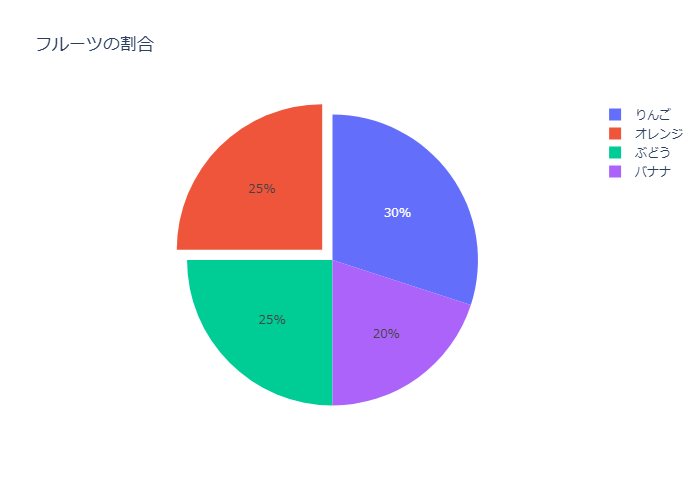
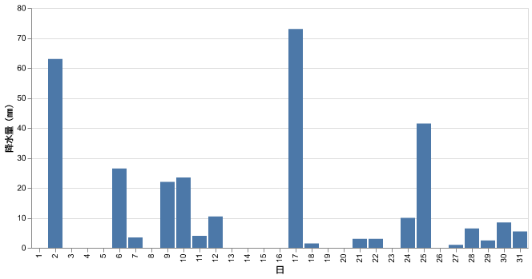
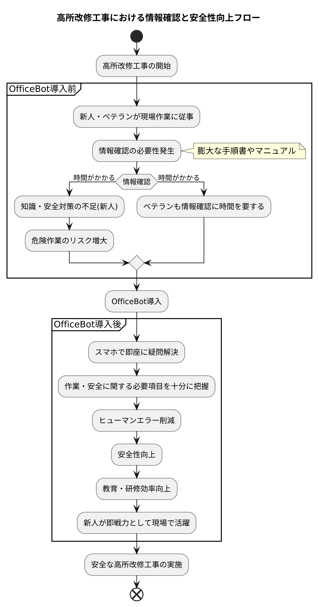
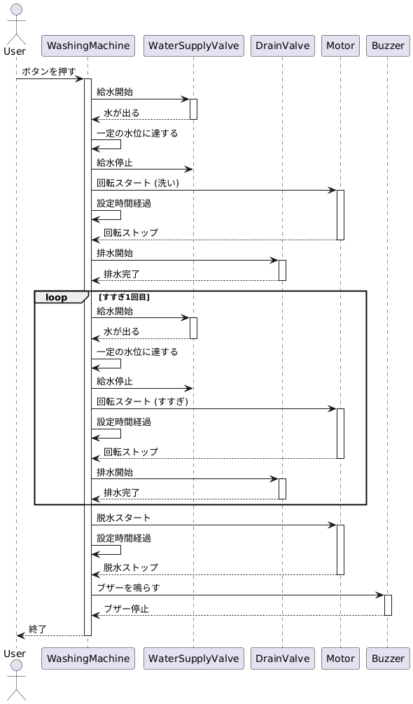
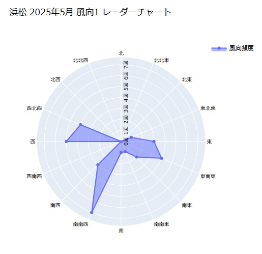

# mcp-diagram-maker

`mcp-diagram-maker` は、Plotly、PlantUML、Mermaid、Vega-Lite を使用して様々な種類のグラフや図を作成するためのModel Context Protocol (MCP) サーバーです。

## 事例
チャート作成の事例:

### Plotly グラフ



### PlantUML 図



### Mermaid チャート


### その他


## 機能

- **Plotlyグラフ作成:** PythonコードからPlotlyグラフを生成し、PNG、SVG、HTML形式で出力します。
- **PlantUML図作成:** PlantUMLのソースコードからフロー図などを生成し、PNG、SVG形式で出力します。
- **Mermaidチャート作成:** Mermaidのソースコードからチャートを生成し、HTML形式で出力します。
- **Vega-Liteチャート作成:** Vega-LiteのJSON仕様からチャートを生成し、PNG、SVG形式で出力します。

## インストール

1. cloneして、uvで仮想環境を再現します。
    ```bash
    git clone repositry
    cd mcp-diagram-maker
    uv sync
    ```

## 使い方
`mcp_setting.json` に記述します。
```
{
  "mcpServers": {
    "mcp-diagram-maker": {
      "autoApprove": [],
      "disabled": false,
      "timeout": 240,
      "type": "stdio",
      "command": "uv",
      "args": [
        "--directory",
        "C:/Users/ooa42/Documents/Python_venv/mcp-diagram-maker",
        "run",
        "mcp-diagram-maker"
      ]
    }
  }
}
```